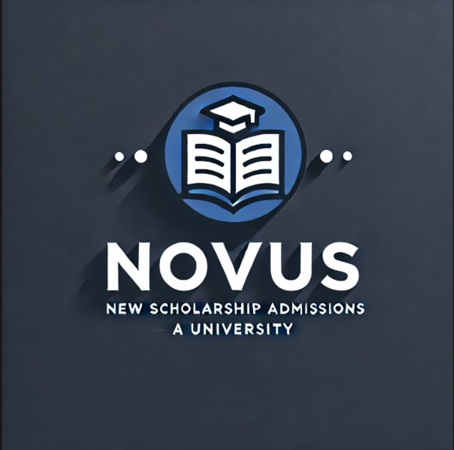

# Novus - Plataforma de Administración de Becarios PROFER

  

## Descripción

Novus es una plataforma diseñada para administrar y optimizar el proceso de selección y capacitación de becarios PROFER de la Universidad Europea del Atlántico. La plataforma permite:

- Gestionar el acceso de postulantes (POSTULANTES)
- Administrar tests de selección para convertir POSTULANTES en BECARIOS
- Proporcionar capacitación mediante videos y documentación
- Generar estadísticas de progreso para los administradores

## Modelo de Dominio

El [modelo de dominio](modelo_del_dominio/README.md) describe las entidades principales del sistema y sus relaciones:

- [Diagrama de Clases](modelo_del_dominio/diagramas_de_clases/README.md)
- [Diagrama de Objetos](modelo_del_dominio/diagramas_de_objetos/README.md)
- [Diagrama de Estados](modelo_del_dominio/diagramas_de_estados/README.md)

## Casos de Uso

Los [casos de uso](casos_de_uso/README.md) definen las interacciones entre los actores y el sistema:

- [Actores](casos_de_uso/actores/README.md)
- [Diagramas de Contexto](casos_de_uso/diagramas_de_contexto/README.md)
- [Diagramas de Casos de Uso](casos_de_uso/diagramas_casos_de_uso/README.md)
- [Prototipos](casos_de_uso/prototipos/README.md)

## Sesiones

Las [actas de reuniones](documentos/actas/README.md) documentan el progreso del proyecto y las decisiones tomadas durante su desarrollo.

## Equipo

- Elías Alarcón Ceballos
- Diego García Niño
- Lydia García Rivero
- Daniel Lavín Aguado
- Maura Martínez Noda

## Metodología

Este proyecto sigue la metodología RUP (Rational Unified Process), que proporciona un enfoque disciplinado para la asignación de tareas y responsabilidades dentro del desarrollo de software.
