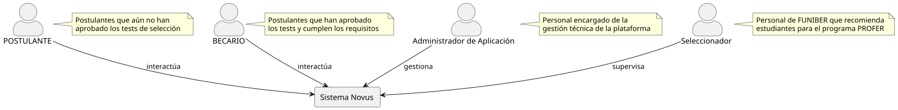

  <a href="http://github.com/Dievex/24-25-IdSw1-SDR/blob/version-002/README.md">
    🏠 <strong>Inicio</strong>
  </a> •
  <a href="https://github.com/Dievex/24-25-IdSw1-SDR/blob/version-002/modelo_del_dominio/README.md">
    📦 <strong>Modelo del Dominio</strong>
  </a> •
  <a href="https://github.com/Dievex/24-25-IdSw1-SDR/blob/version-002/casos_de_uso/README.md">
    ⚙️ <strong>Casos de Uso</strong>
  </a>

# Actores del Sistema

Los actores son entidades externas que interactúan con el sistema Novus. Pueden ser personas, otros sistemas o dispositivos.

## Descripción

Este documento define los actores principales del sistema Novus y sus características:

## Diagrama

### Explicación del Diagrama

El diagrama muestra los cuatro actores principales que interactúan con el Sistema Novus:

1. **Postulante**: Postulantes en proceso de selección
2. **Becario**: Postulantes ya seleccionados
3. **Administrador de Aplicación**: Gestores técnicos del sistema
4. **Seleccionador**: Supervisores del programa que recomienda estudiantes para el programa PROFER
5. **Usuario no registrado**: Usuarios que no han accedido al sistema

Cada actor tiene un rol específico y diferentes niveles de acceso al sistema, como se detalla a continuación.

## Actores Principales

### Postulante
- **Descripción**: Postulantes que aún no han aprobado los tests de selección
- **Responsabilidades**:
  - Acceder a la plataforma con credenciales proporcionadas por la sede
  - Realizar tests de selección
  - Acceder a material básico de capacitación
  - Ver su propio progreso

### Becario
- **Descripción**: Postulantes que han aprobado los tests y cumplen los requisitos
- **Responsabilidades**:
  - Acceder a material avanzado de capacitación
  - Ver su propio progreso

### Administrador de Aplicación
- **Descripción**: Personal encargado de la gestión técnica de la plataforma
- **Responsabilidades**:
  - Gestionar usuarios
  - Subir material de capacitación
  - Crear y modificar tests
  - Ver estadísticas de todos los usuarios

### Seleccionador
- **Descripción**: Personal de FUNIBER que recomienda estudiantes para el programa PROFER
- **Responsabilidades**:
  - Ver estadísticas de todos los usuarios
  - Tomar decisiones basadas en los resultados
  - Supervisar el proceso de selección y capacitación

### Usuario no registrado
- **Descripción**: Usuarios que no han accedido al sistema

