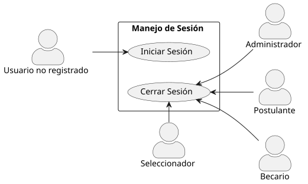
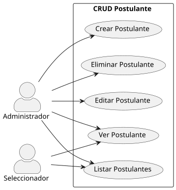
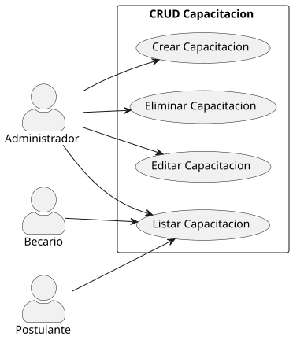
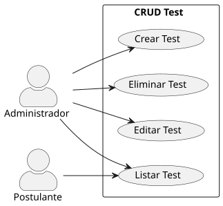
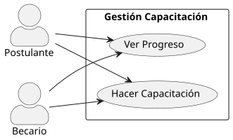
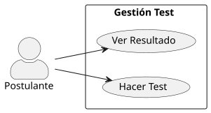
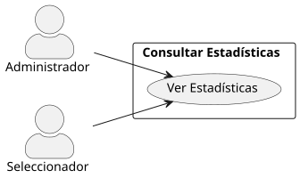

  <a href="http://github.com/Dievex/24-25-IdSw1-SDR/blob/version-002/README.md">
    🏠 <strong>Inicio</strong>
  </a> •
  <a href="https://github.com/Dievex/24-25-IdSw1-SDR/blob/version-002/modelo_del_dominio/README.md">
    📦 <strong>Modelo del Dominio</strong>
  </a> •
  <a href="https://github.com/Dievex/24-25-IdSw1-SDR/blob/version-002/casos_de_uso/README.md">
    ⚙️ <strong>Casos de Uso</strong>
  </a>

# Diagramas de Casos de uso
## Actores del Sistema

Los siguientes actores participan en los casos de uso:

- **Usuario**: Actor base del cual heredan los demás actores
- **Administrador**: Gestiona el sistema completo (usuarios, capacitaciones, tests)
- **Seleccionador**: Consulta información y ve los postulantes
- **Postulante**: Realiza tests y capacitaciones
- **Becario**: Realiza capacitaciones y consulta su progreso

## Diagramas Disponibles

### 1. Gestión de Sesiones
**Archivo**: `manejo_sesion.puml`

**Descripción**: Define los casos de uso relacionados con la autenticación y manejo de sesiones de usuario.

**Casos de uso incluidos**:
- Iniciar Sesión
- Cerrar Sesión

**Actores involucrados**: Todos los actores del sistema (Usuario base)

---

### 2. CRUD de Postulantes
**Archivo**: `crud_postulante.puml`

**Descripción**: Gestión completa de postulantes en el sistema.

**Casos de uso incluidos**:
- Crear Postulante
- Listar Postulante
- Editar Postulante
- Eliminar Postulante

**Actores involucrados**:
- **Administrador**: Acceso completo (CRUD)
- **Seleccionador**: Solo consulta (Listar)

---

### 3. CRUD de Capacitaciones
**Archivo**: `crud_capacitacion.puml`

**Descripción**: Administración de capacitaciones disponibles en el sistema.

**Casos de uso incluidos**:
- Crear Capacitación
- Listar Capacitación
- Editar Capacitación
- Eliminar Capacitación

**Actores involucrados**:
- **Administrador**: Acceso completo (CRUD)
- **Becario**: Solo consulta (Listar)
- **Postulante**: Solo consulta (Listar)

---

### 4. CRUD de Tests
**Archivo**: `crud_test.puml`

**Descripción**: Gestión de tests y evaluaciones del sistema.

**Casos de uso incluidos**:
- Crear Test
- Listar Test
- Editar Test
- Eliminar Test

**Actores involucrados**:
- **Administrador**: Acceso completo (CRUD)
- **Postulante**: Solo consulta (Listar)

---

### 5. Gestión de Capacitaciones
**Archivo**: `gestion_capacitacion.puml`

**Descripción**: Funcionalidades para realizar y seguir el progreso de capacitaciones.

**Casos de uso incluidos**:
- Hacer Capacitación
- Ver Progreso

**Actores involucrados**:
- **Postulante**: Puede realizar capacitaciones y ver su progreso
- **Becario**: Puede realizar capacitaciones y ver su progreso

---

### 6. Gestión de Tests
**Archivo**: `gestion_test.puml`

**Descripción**: Funcionalidades para realizar tests y consultar resultados.

**Casos de uso incluidos**:
- Hacer Test
- Ver Resultado

**Actores involucrados**:
- **Postulante**: Puede realizar tests y consultar sus resultados

---

### 7. Consulta de Estadísticas
**Archivo**: `consultar_estadisticas.puml`

**Descripción**: Funcionalidades para consultar estadísticas del sistema.

**Casos de uso incluidos**:
- Ver Estadísticas

**Actores involucrados**:
- **Administrador**: Puede consultar estadísticas generales
- **Seleccionador**: Puede consultar estadísticas relevantes

---
