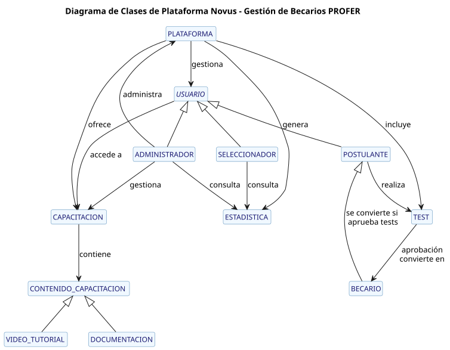

# Diagrama de Clases

El diagrama de clases muestra la estructura estática del sistema Novus, definiendo las clases, sus atributos, operaciones y las relaciones entre ellas.

## Descripción

Este diagrama representa:

1. **Jerarquía de Usuarios**:
   - La clase base `Usuario` con atributos comunes
   - Especialización en `POSTULANTE`, `BECARIO` y `Administrador`
   - Transición de `POSTULANTE` a `BECARIO` mediante la aprobación de tests

2. **Recursos de Capacitación**:
   - Clase `Capacitación` que agrupa recursos formativos
   - Especialización en `Video` y `Documentación`

3. **Evaluación**:
   - Clase `Test` con sus preguntas y criterios de evaluación
   - Relación con `POSTULANTE` para el proceso de selección

4. **Seguimiento**:
   - Clase `Estadística` para el monitoreo del progreso
   - Relaciones con usuarios y recursos para la trazabilidad

## Diagrama

