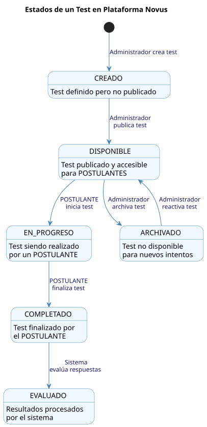
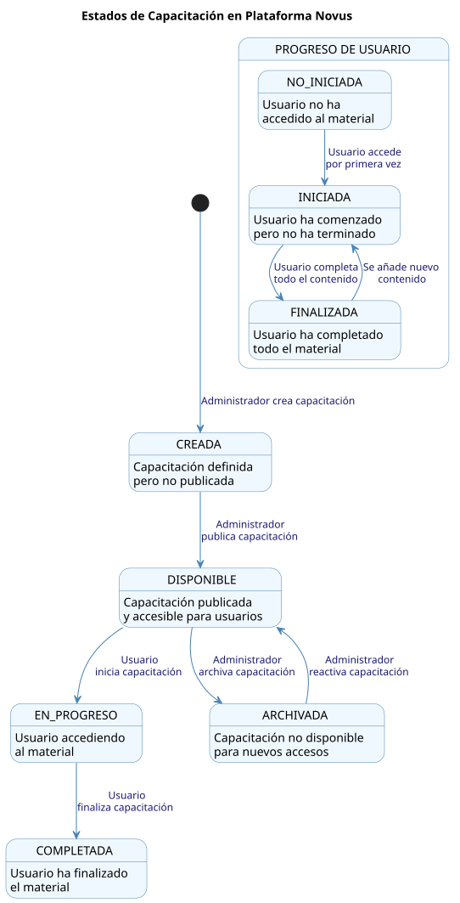

# Diagrama de Estados

El diagrama de estados muestra los diferentes estados por los que pasan las entidades del sistema Novus y las transiciones entre estos estados.

## Descripción

Este diagrama representa:

1. **Estados de un Postulante**:
   - Transición de POSTULANTE a BECARIO
   - Estados intermedios durante el proceso de selección
   - Condiciones para la aprobación o rechazo

2. **Estados de un Test**:
   - Creado → Disponible → En Progreso → Completado → Evaluado
   - Ciclo de vida completo desde la creación hasta la evaluación
   - Posibilidad de archivar y reactivar tests

3. **Estados de Capacitación**:
   - Creada → Disponible → En Progreso → Completada
   - Ciclo de vida completo de los recursos formativos
   - Seguimiento del progreso individual de los usuarios

## Diagramas

### Diagrama de Estados del Postulante

### Diagrama de Estados del Test

### Diagrama de Estados de la Capacitación

## Estados Principales

### Estados de Postulante
- **No Registrado**: Usuario sin acceso al sistema
- **NO_BECARIO**: Usuario con acceso básico, puede realizar tests y acceder a capacitación básica
- **En Evaluación**: Usuario realizando tests
- **Evaluado**: Tests completados, pendiente de resultados
- **BECARIO**: Usuario con acceso completo, puede acceder a capacitación avanzada
- **Rechazado**: No cumple los requisitos, puede intentar nuevamente

### Estados de Test
- **Creado**: Test definido pero no publicado
- **Disponible**: Test publicado y accesible para NO_BECARIOS
- **En Progreso**: Test siendo realizado por un NO_BECARIO
- **Completado**: Test finalizado por el NO_BECARIO
- **Evaluado**: Resultados procesados por el sistema
- **Archivado**: Test no disponible para nuevos intentos

### Estados de Capacitación
- **Creada**: Capacitación definida pero no publicada
- **Disponible**: Capacitación publicada y accesible para usuarios
- **En Progreso**: Usuario accediendo al material
- **Completada**: Usuario ha finalizado el material
- **Archivada**: Capacitación no disponible para nuevos accesos

#### Progreso de Usuario en Capacitación
- **No Iniciada**: Usuario no ha accedido al material
- **Iniciada**: Usuario ha comenzado pero no ha terminado
- **Finalizada**: Usuario ha completado todo el material