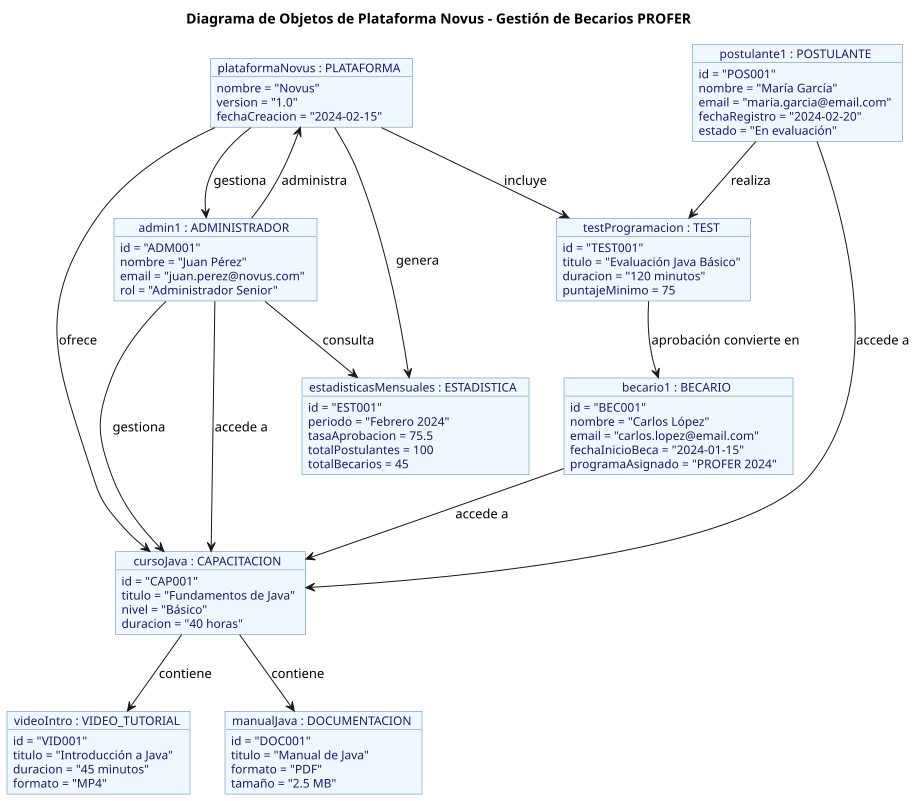

# Diagrama de Objetos

El diagrama de objetos muestra instancias concretas de las clases definidas en el diagrama de clases, ilustrando cómo se relacionan en escenarios específicos del sistema Novus.

## Descripción

Este diagrama representa:

1. **Instancias de Usuarios**:
   - Ejemplos de POSTULANTES en diferentes etapas del proceso
   - Ejemplos de BECARIOS que han completado el proceso
   - Administradores del sistema

2. **Tests y Resultados**:
   - Tests específicos con sus características
   - Resultados de tests para diferentes usuarios
   - Transición de POSTULANTE a BECARIO tras aprobar tests

3. **Recursos de Capacitación**:
   - Videos específicos con sus atributos
   - Documentos específicos con sus atributos
   - Relación entre usuarios y los recursos que han utilizado

4. **Estadísticas**:
   - Ejemplos de registros estadísticos
   - Trazabilidad de actividades de usuarios específicos

## Diagrama

### Plataforma
- **plataformaNovus**: {nombre: "Novus", version: "1.0", fechaCreacion: "2024-02-15"}

### Usuarios
- **postulante1**: {id: "POS001", nombre: "María García", email: "maria.garcia@email.com", fechaRegistro: "2024-02-20", estado: "En evaluación"}
- **becario1**: {id: "BEC001", nombre: "Carlos López", email: "carlos.lopez@email.com", fechaInicioBeca: "2024-01-15", programaAsignado: "PROFER 2024"}
- **admin1**: {id: "ADM001", nombre: "Juan Pérez", email: "juan.perez@novus.com", rol: "Administrador Senior"}

### Tests
- **testProgramacion**: {id: "TEST001", titulo: "Evaluación Java Básico", duracion: "120 minutos", puntajeMinimo: 75}

### Capacitación
- **cursoJava**: {id: "CAP001", titulo: "Fundamentos de Java", nivel: "Básico", duracion: "40 horas"}
- **videoIntro**: {id: "VID001", titulo: "Introducción a Java", duracion: "45 minutos", formato: "MP4"}
- **manualJava**: {id: "DOC001", titulo: "Manual de Java", formato: "PDF", tamaño: "2.5 MB"}

### Estadísticas
- **estadisticasMensuales**: {id: "EST001", periodo: "Febrero 2024", tasaAprobacion: 75.5, totalPostulantes: 100, totalBecarios: 45}