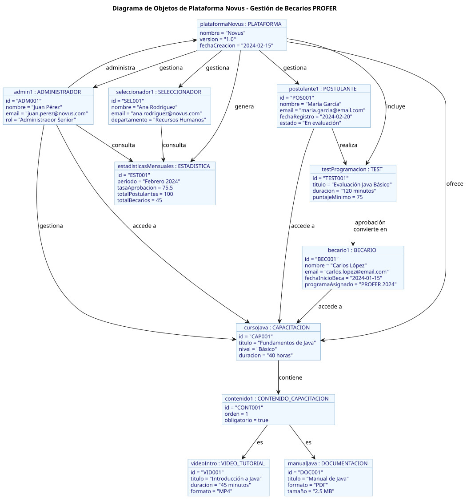

# Diagrama de Objetos

El diagrama de objetos muestra instancias concretas de las clases definidas en el diagrama de clases, ilustrando cómo se relacionan en escenarios específicos del sistema Novus.

## Descripción

Este diagrama representa:

1. **Instancias de Usuarios**:
   - Ejemplos de POSTULANTES en diferentes etapas del proceso
   - Ejemplos de BECARIOS que han completado el proceso
   - Administradores del sistema

2. **Tests y Resultados**:
   - Tests específicos con sus características
   - Resultados de tests para diferentes usuarios
   - Transición de POSTULANTE a BECARIO tras aprobar tests

3. **Recursos de Capacitación**:
   - Videos específicos con sus atributos
   - Documentos específicos con sus atributos
   - Relación entre usuarios y los recursos que han utilizado

4. **Estadísticas**:
   - Ejemplos de registros estadísticos
   - Trazabilidad de actividades de usuarios específicos

## Diagrama

